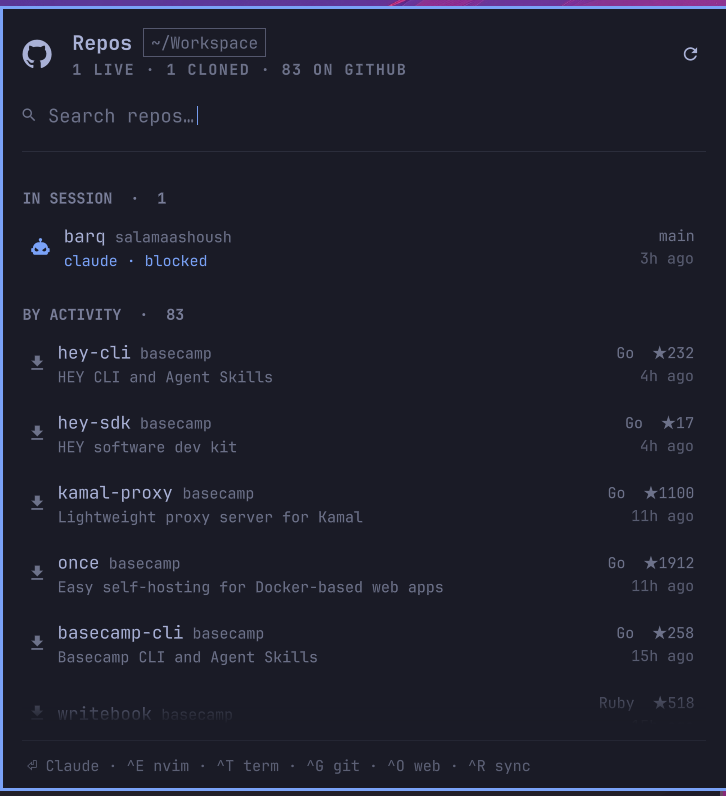

# Depot — an Omarchy shell plugin

Every GitHub repo you can reach, in your Omarchy bar. See which checkouts have
uncommitted work, clone the ones you haven't, and start your coding agent in
any of them — without leaving the keyboard.



## Install

```bash
omarchy plugin add https://github.com/salamaashoush/omarchy-depot.git --enable --yes
omarchy restart shell
```

Requires [`gh`](https://cli.github.com/) signed in (`gh auth login`), plus
`python3` and `jq`, which Omarchy already ships. [`herdr`](https://herdr.dev)
is needed only for agent sessions and also ships with Omarchy; set an agent
with `omarchy default agent <name>` if you haven't. Optional: `lazygit` for the
git action.

To summon it from the keyboard, add a binding to `~/.config/hypr/bindings.lua`:

```lua
o.bind("SUPER + SHIFT + R", "Repos", "omarchy-shell sashoush.depot toggle")
```

Pick a combination that is free on your machine — `hyprctl binds -j` is the
authority, and it is worth avoiding keys one slipped modifier away from
something disruptive.

## Removing

```bash
omarchy plugin remove sashoush.depot --yes
omarchy restart shell
```

That drops the widget from the bar and deletes the plugin directory. Two things
live outside it and are safe to delete by hand: the cached GitHub listing at
`~/.local/state/omarchy/depot/remote.json`, and any keybinding you added to
`~/.config/hypr/bindings.lua`. The plugin never writes anywhere else — it does
not touch your git config, your repos, or any Omarchy config besides its own
entry in `shell.json`.

## Order

Two groups earn the top by being unfinished work: **IN SESSION** (a herdr pane
running an agent in that checkout) and **UNCOMMITTED WORK**. Everything else is
one **BY ACTIVITY** stream, cloned and uncloned interleaved, newest first,
where activity is `max(your last commit, GitHub's last push)` — the same number
the row displays, so a row's position and its stated age never disagree.

Sorting cloned repos above uncloned ones was the obvious first design and the
wrong one: it buried a repo pushed an hour ago under a checkout last touched
two years ago.

## Keys

Typing filters. Prefix matches on the repo name rank above substring matches,
above matches in the description; `clts` finds `clap-ts` by subsequence.

| Key | Action |
|---|---|
| `⏎` | Cloned → agent session. Not cloned → clone, then session |
| `^D` | Clone only |
| `^E` | Editor (`omarchy-launch-editor`, so whatever `omarchy` is set to) |
| `^T` | Terminal in the checkout |
| `^G` | lazygit |
| `^O` | Open on GitHub |
| `^R` | Force a GitHub refresh |
| `^N` / `^P` | Move the cursor (arrows work too; `j`/`k` type into the filter) |
| `Esc` | Clear the filter, then close |

Bar icon: left click opens, right click refreshes. On a row, left click runs the
primary action and middle click opens it on GitHub. The active row reveals
editor / lazygit / GitHub buttons in place of its status column, so the row
never changes height under the pointer.

## Sessions

`⏎` on a checkout starts herdr if it isn't up, waits for its socket, creates a
workspace with `--cwd` at the repo, and starts your coding agent in that
workspace's root pane.

Which agent? By default whatever `omarchy default agent` is set to — the same
setting the rest of Omarchy reads — so there is nothing to configure if you
already picked one. Pin a different one just for this panel with the `agent`
setting. herdr can detect and drive `pi`, `claude`, `codex`, `gemini`, `grok`,
`omp`, `opencode` and `copilot`; anything else (`crush`) still launches, it just
runs as a plain command in the pane without herdr's agent status.

Every repo becomes **another workspace inside the one running herdr session**,
never a second herdr instance — so herdr's workspace bindings walk between the
repos you have open. Opening a repo that already has a session focuses it
rather than stacking a second agent on the same checkout, and that lookup
matches on the pane's **working directory**, not its label: labels are repo
short names, and two owners can share one.

Sessions prompt for approval as usual. To start them unattended:

```bash
omarchy bar set sashoush.depot autoApprove true --json
```

That applies the same flag Omarchy's own launcher uses for your agent
(`--permission-mode auto` for Claude, `--yolo` for Gemini, `--approve-for-me`
for Codex, and so on). `agentArgs` appends anything else you want.

## Clone destinations

A repo clones to `<workspaceDir>/<name>`. When more than one repo wants that
folder name — two orgs with a `.github` repo, or the same project name under a
personal account and an org — the contested ones go to
`<workspaceDir>/<owner>/<name>` instead, which the depth-2 scan then finds.
Uncontested names stay flat. Cloning goes through `gh`, so it honors your
`gh config git_protocol` and authenticates for private repos.

## Settings

`omarchy bar set sashoush.depot <key> <value>` (numbers and booleans need
`--json`):

| Key | Default | Meaning |
|---|---|---|
| `workspaceDir` | `~/Workspace` | Where clones land and checkouts are scanned |
| `scanDepth` | `2` | Levels below the workspace to search. 2 finds both `<ws>/repo` and `<ws>/owner/repo` |
| `owners` | `[]` | Empty auto-detects your GitHub login plus every org you belong to. Set it to pin the list |
| `refreshIntervalSec` | `90` | Local rescan cadence while the panel is open. Closed, it drops to `max(600, that × 8)` — each tick costs two git processes per checkout, and a closed panel only has to keep the bar dot honest |
| `remoteTtlSec` | `1800` | How stale the cached GitHub listing may get |
| `repoLimit` | `200` | Repos fetched per owner. An owner that hits the limit is named in the panel's status line rather than silently truncated |
| `includeForks` | `false` | Forks are hidden by default |
| `agent` | `auto` | `auto` follows `omarchy default agent`; or pin one of `pi`, `omp`, `opencode`, `claude`, `codex`, `grok`, `gemini`, `copilot`, `crush` |
| `autoApprove` | `false` | Start the agent without approval prompts, using the same flag Omarchy's own launcher uses for it |
| `agentArgs` | `""` | Extra arguments appended to the agent's command line |
| `cloneProtocol` | `auto` | `auto` follows `gh config git_protocol`; `ssh` or `https` force that transport |
| `editorCommand` | `""` | Empty uses `omarchy-launch-editor` |

## How it works

```
manifest.json   plugin + settings schema
Panel.qml       bar icon and popup — the only view code
Service.qml     owns every subprocess; the view never spawns one
Model.js        formatting, filtering, grouping — stateless
repos.py        the inventory scan
actions.sh      clone / session / open, one JSON line per call
```

`repos.py` walks the workspace `scanDepth` levels down for checkouts, running
`git status --porcelain=v2 --branch` across a thread pool, and merges that with
`gh repo list` for every owner. A directory that is itself a checkout is never
descended into, so vendored submodules don't each become a row.

The GitHub half is cached in `~/.local/state/omarchy/depot/remote.json`. The
panel's periodic scan passes `--stale-ok` and never touches the network, so it
stays a local pass measured in tens of milliseconds; a cold fetch of several
hundred repos takes seconds and only happens on the refresh button, `^R`, or
once the cache passes its TTL — always in the background, with the cached list
already on screen. A failed refresh keeps serving the last good cache rather
than blanking the list.

Every color and metric comes from the `qs.Commons` `Color` and `Style`
singletons, so `omarchy theme set <name>` re-themes the widget with no work
here.

## Hacking on it

Saving a file re-registers the plugin but does **not** reliably re-instantiate
the bar widget on Omarchy 4.0.1 — a stale panel keeps rendering, with no error
anywhere. Run `omarchy restart shell` to see QML or JS changes.

```bash
omarchy plugin validate .          # manifest + entry points
python3 repos.py --stale-ok | jq   # the scan, without the shell
./actions.sh clone "" /tmp/x owner/name
```

## License

MIT
